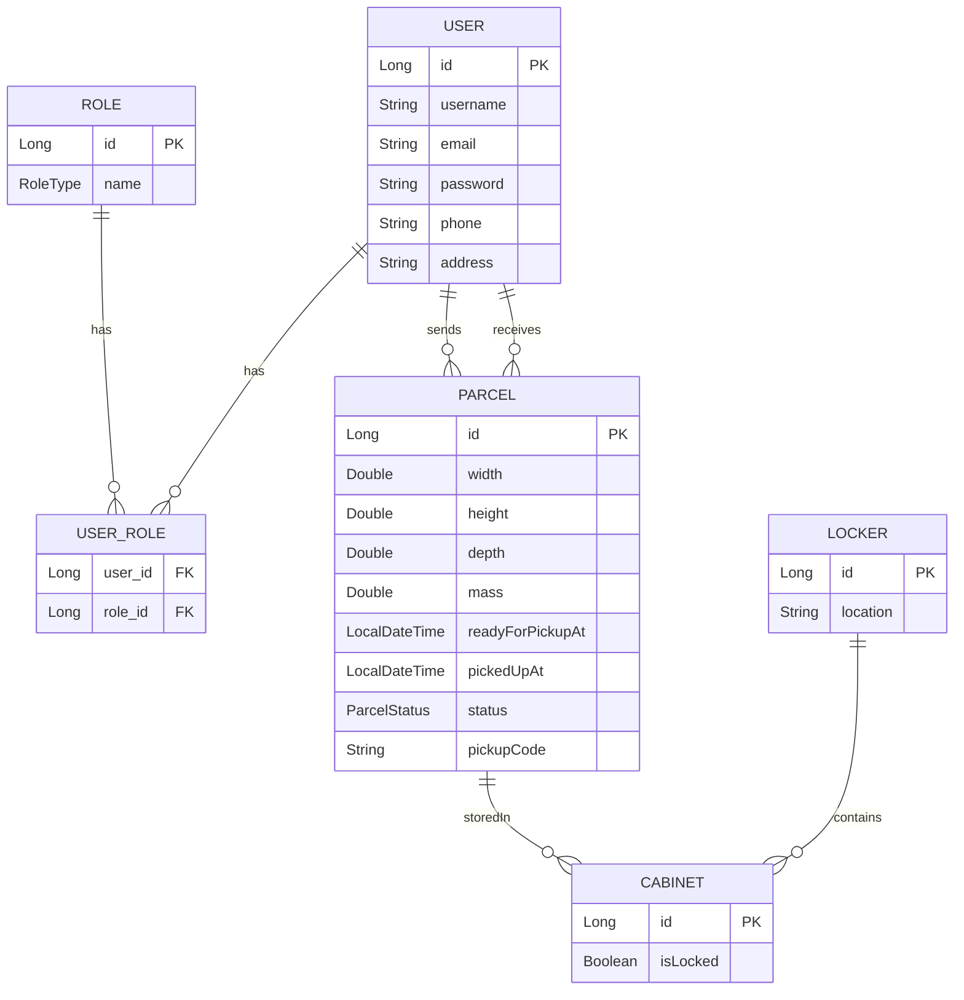

# Design

## Database Schema

The USER entity is central, representing the different types of users - guest, consumers, delivery drivers, and
potentially administrators. This directly relates to the three kinds of users mentioned in the instructions.
The ROLE entity, in conjunction with the USER_ROLE junction table, facilitates role-based access, essential
for distinguishing between consumer users, drivers, and any other roles within the system.

The PARCEL entity captures detailed information about each parcel, such as dimensions, mass, and status, which
aligns with the requirement for tracking parcel information and history in the consumer user app (C3). The LOCKER
and CABINET entities are crucial for simulating the parcel locker system, reflecting the physical infrastructure
where parcels are stored and retrieved. This directly corresponds to the functionality required in the parcel
locker touchscreen simulator (TS2, TS3) and driver app (D2, D3, D4).

Moreover, the relationships between these entities are thoughtfully designed. For example, the connection between
USER and PARCEL (for sending and receiving parcels) underpins the fundamental operations of sending and receiving
parcels as required in the consumer user app (C6) and driver app (D3, D4). The linkage between PARCEL and CABINET
(storedIn) is pivotal for the functionality where parcels are assigned to specific cabinets, which is integral to
both the parcel locker simulator and the driver app functionalities.

## APIs and Logic

1. Authentication Logic
   * Implements JWT or session-based authentication for secure user sessions.

2. Parcel Creation & Allocation Logic
   * Allocates new parcels to free cabinets in selected lockers.

3. Cabinet Opening Logic
   * Validates codes and opens the corresponding cabinet for parcel pickup or delivery.

4. Notification Logic
   * Triggers email notifications when parcels are ready for pickup.
